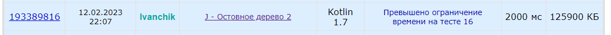
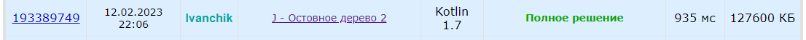
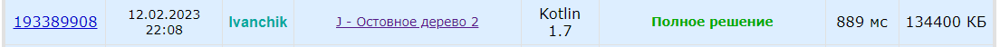
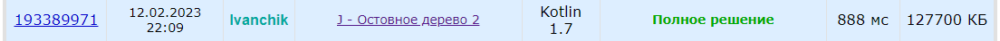
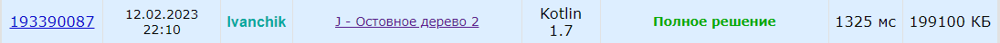
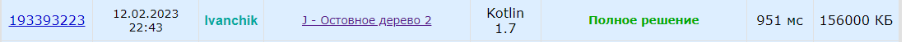

# Нахождение минимального остовного дерева алгоритмом Крускала

### Алгоритм Крускала

Алгоритм Крускала изначально помещает каждую вершину в своё дерево, а затем итеративно объединяет эти деревья.
Изначально все рёбра сортируются по весу в порядке неубывания.
Затем перебираются все рёбра от первого до последнего,
и если у текущего ребра концы принадлежат разным поддеревьям, то эти поддеревья объединяются, а
ребро добавляется к ответу.
В конце перебора всех рёбер все вершины будут принадлежать одному поддереву,
которое и будет являться минимальным остовом.

Для проверки принадлежности вершин к поддеревьям и их объединения
с точки зрения оптимальности ассимптотики лучше всего использовать СНМ (систему непересекающихся множеств).

Статьи на e-maxx об Алгоритме Крускала: [наивная реализация](https://e-maxx.ru/algo/mst_kruskal),
[используя СНМ](https://e-maxx.ru/algo/mst_kruskal_with_dsu).

### Реализация алгоритма, время его работы

В рамках работы на языке `Kotlin` был [реализован алгоритм](./src/main/kotlin/KruskalMST.kt)
Крускала с использованием СНМ.

Корректность реализации была проверена на задаче
["Остовное дерево 2"](https://codeforces.com/group/CYMPFXi8zA/contest/254629/problem/J).

Так как основную часть алгоритма составляет СНМ,
было решено протестировать время работы различных версий СНМ
(наивная, со сжатием путей и объединением по рангу на основе глубины деревьев).

#### Результаты на Codeforces

На сайте Codeforces реализация с наивным СНМ не прошла по времени:

Реализация СНМ без сжатия путей, но с объединением по рангу показала результат в `935мс`:

Реализация СНМ со сжатием путей, но без объединения по рангу показала результат в `889мс`:

Реализация СНМ со сжатием путей и с объединением по рангу показала наилучший,
но практически идентичный результат в `888мс`:

Описанные выше методы производили чтение входных данных из консоли
с помощью встроенной в стандартную библиотеку языка `Kotlin` функцию `readLine`.

Использование класса `java.util.Scanner` из библиотеки `Java` показало
приемлемый результат, но хуже (используется СНМ со сжатием путей и с объединением по рангу):

Помимо этого, был протестирован функциональный способ суммаризации ответа
(в функции `KruskalMST.solve()`), однако он показал результат хуже, чем простое суммирование в цикле
(используется СНМ со сжатием путей и с объединением по рангу):

#### Результаты собственноручного тестирующего метода

Для оценки времени работы алгоритмов был [реализован](./src/test/kotlin/TestKruskalTime.kt)
рандомизированный метод генерации взвешенного связного графа с заданным количеством вершин и ребер.

Ограничения на максимальное количество вершин, ребер и максимальный вес
ребер были аналогичны задаче из Codeforces.

Итоговая оценка является средним временем для `50` тестов.

Результаты:

* Полностью наивный СНМ: `6116.36ms`.
* СНМ без сжатия путей, но с объединением по рангу: `70.1ms`.
* СНМ со сжатием путей, но без объединения по рангу: `77.78ms`.
* СНМ со сжатием путей и с объединением по рангу: `65.18ms`.

Таким образом, результаты показывают, что использование хотя бы
одной эвристики в СНМ значительно улучшает время работы алгоритма.

### Оценка ассимптотики алгоритма Крускала

Общей частью в алгоритме Крускала является первый шаг - сортировка ребер в порядке неубывания весов.
Этот шаг занимает `O(E * log(E))` времени (`E` - количество ребер, `V` - количество вершин).

Ассимптотика этапа перебора всех ребер зависит от реализации СНМ.

Однократное создание СНМ требует `O(V)` времени.

Метод `unionSets` - это два вызова метода `findSet` и `O(1)` операций,
поэтому нужно оценить только метод `findSet`.

Метод `findSet` в наивной реализации СНМ без эвристик занимает `O(V)` времени
(худший случай - вырождение дерева в бамбук), поэтому в цикле во время перебора время будет `O(E * V)`.

В реализациях с одной эвристикой работа с СНМ стоит `O(log(V))` времени,
поэтому в цикле получается `O(E * log(V))`.

Реализация СНМ с обоими эвристиками в среднем требует почти константное время работы: `O(alpha(V))`,
где `alpha` - обратная функция Аккермана, которая растёт настолько медленно,
что для всех разумных ограничений `V` она не превосходит 4 (`V < 10^600`).
Итого время перебора в цикле: `O(E * alpha(V))`.

Итого общее время работы наилучшей реализации: `O(E * log(E) + V + E * alpha(V))` ~ `O(E * log(E))`.

### Объяснение различия времени работы разных реализаций

1. Известно, что класс `Scanner` в языке `Java` является довольно медленным.
2. Функциональный способ суммаризации ответа вероятнее всего несет издержки при касте Int в Long,
   однако полученное время работы не сильно отличается от обычного цикла, поэтому возможно это погрешность.
3. Наивная реализация СНМ теоретически работает долго,
   поэтому логично, что реальное время работы гораздо хуже.
4. Реализация с двумя эвристиками была лучше всех как теоретически, так и практически.
   Однако вероятно так как при невысоком количестве ребер (до `2 * 10^5`)
   двоичный логарифм дает значение не более `17.6`,
   то вкупе с невысокими константами отдельных наивных методов время работы не сильно
   отличается от реализации СНМ с двумя эвристиками.

### Выводы

В рамках лабораторной работы был реализован алгоритм Крускала с различными версиями СНМ.

Корректность алгоритма была проверена на сайте Codeforces,
для подсчета времени работы алгоритмы был написан самописный рандомизированный генератор тестов.

Было выяснено, что СНМ с двумя эвристиками показывает лучшее время работы,
однако наличие хотя бы одной эвристики уже значительно улучшает время работы.

Помимо этого, были произведены оптимизации кода, например, замена класса `Scanner` на метод `readLine`.

В работе было показано время работы алгоритма Крускала и
приведены объяснения различия времени работы разных реализаций.